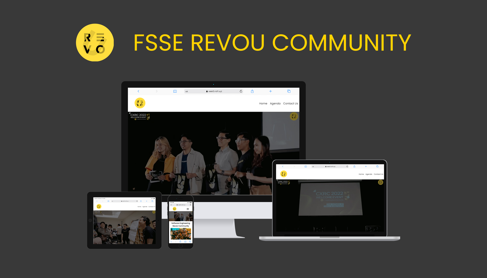
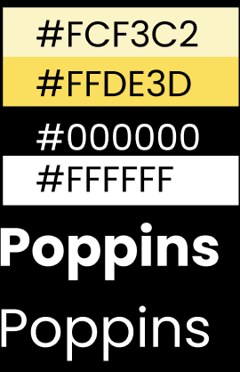

# Website Software Engineering RevoU Community

The FSSE RevoU Community Website is a community for students and alumni of the full stack software engineering RevoU program. Provide a platform for FSSE members to meetup offline.

## :bulb: Inspiration

[Revou Community](https://revou.co/community)

## :page_facing_up: Pages

- [Home](images/pagereadme/home.png)
- [ Agenda](images/pagereadme/agenda.png)
- [Contact Us](images/pagereadme/contactus.png)
- [Event](images/pagereadme/event.png)
- [Chapter](images/pagereadme/chapter.png)

## :art: Font & Color Palettes

## :link: Links & URLs

- [Github Pages](https://revou-fsse-1.github.io/w5-company-website-group-e/)
- [revou-community.netlify.app](https://revou-community.netlify.app/) | [fsserevoucommunity.netlify.app](fsserevoucommunity.netlify.app)
- [fsse-revou-community.nofri.xyz](https://fsse-revou-community.nofri.xyz/) | [fsserevoucommunity.mesel.site](https://fsserevoucommunity.mesel.site/)

## :paintbrush: link Figma

Link figma : [Click here Go To Figma !](https://www.figma.com/file/zfYDjauniHSURSOglnn7MH/group-e?t=plnwYZRdyu2NjnGo-0/)

## :construction: Used Tools:

